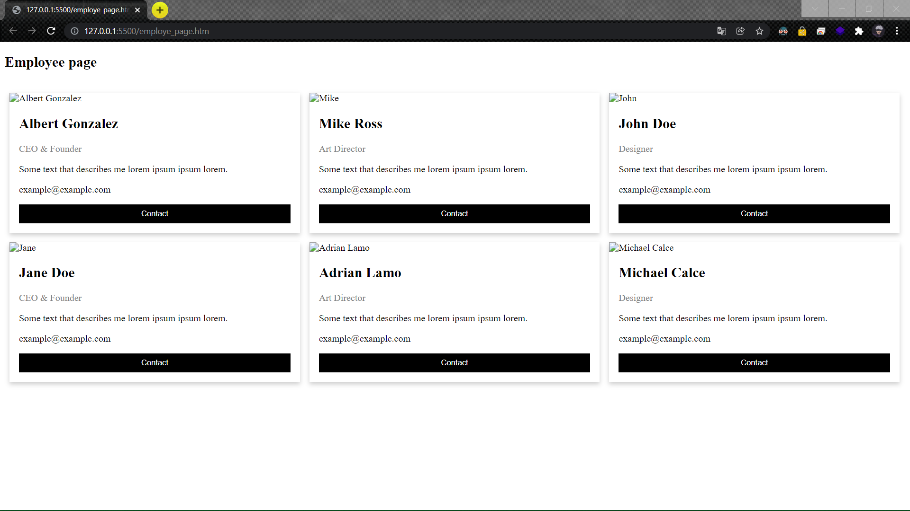

# Employee-page

## AIM
Design a wesite for company employee page

# ALGORITHM
### STEP 1
create a simple html page using heading tag
### STEP 2
Add a div tag to create a container for employee details
### STEP 3
Add a css for color, style to make good user interaction and responsive
### STEP 4
Execute the program
# CODE
~~~
<!DOCTYPE html>
<html>
<head>
<meta name="viewport" content="width=device-width, initial-scale=1">

</head>
<body>

<h2>Employee page</h2>

 

  

    

      
      

        <h2>Albert Gonzalez</h2>
        
CEO & Founder

        
Some text that describes me lorem ipsum ipsum lorem.

        
example@example.com

        
<button class="button">Contact</button>

      

    

  

    

    

      
      

        <h2>Mike Ross</h2>
        
Art Director

        
Some text that describes me lorem ipsum ipsum lorem.

        
example@example.com

        
<button class="button">Contact</button>

      

    

  

    

    

      
      

        <h2>John Doe</h2>
        
Designer

        
Some text that describes me lorem ipsum ipsum lorem.

        
example@example.com

        
<button class="button">Contact</button>

      

    

  

  

    

      

        
        

          <h2>Jane Doe</h2>
          
CEO & Founder

          
Some text that describes me lorem ipsum ipsum lorem.

          
example@example.com

          
<button class="button">Contact</button>

        

      

    

    

      

        
        

          <h2>Adrian Lamo</h2>
          
Art Director

          
Some text that describes me lorem ipsum ipsum lorem.

          
example@example.com

          
<button class="button">Contact</button>

        

      

    

    

      

        
        

          <h2>Michael Calce</h2>
          
Designer

          
Some text that describes me lorem ipsum ipsum lorem.

          
example@example.com

          
<button class="button">Contact</button>

        

      

    

</body>
</html>

~~~
# OUPUT

# RESULT
wesite for company employee page was successfully executed.
